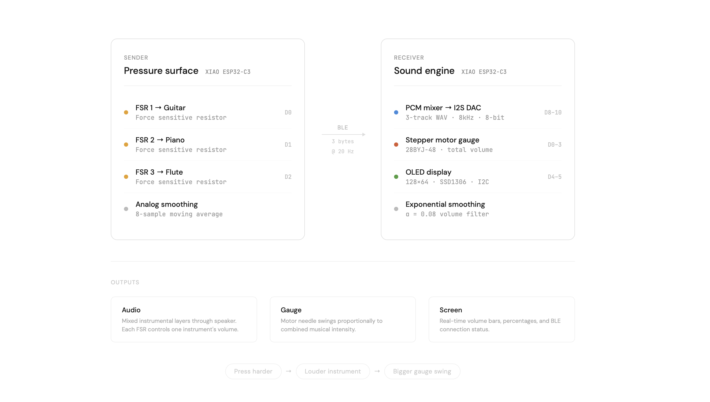
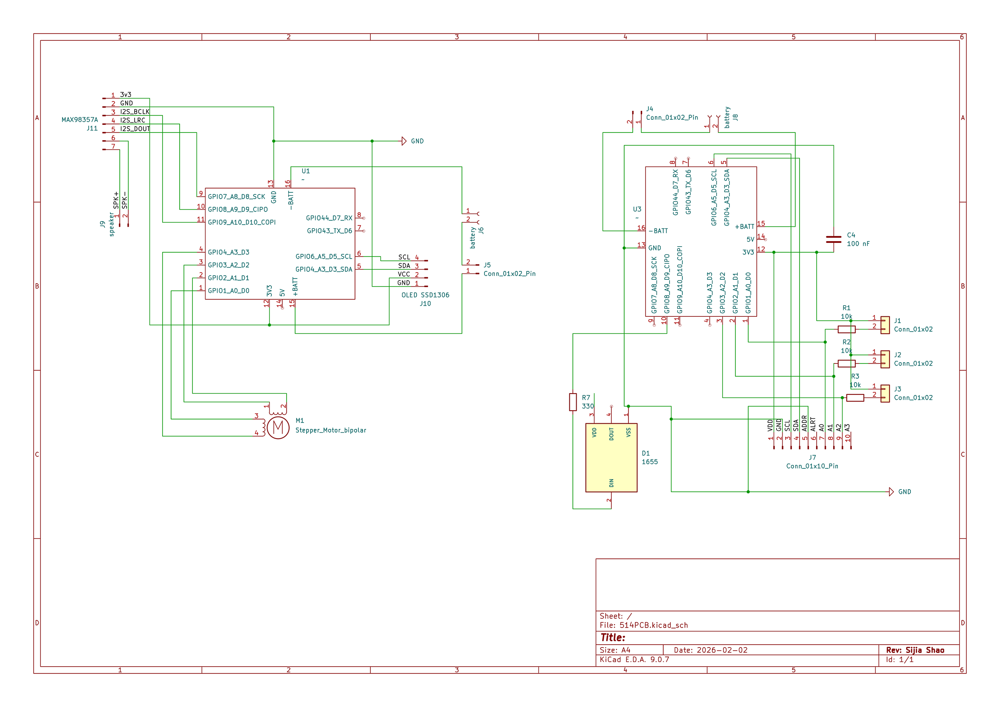
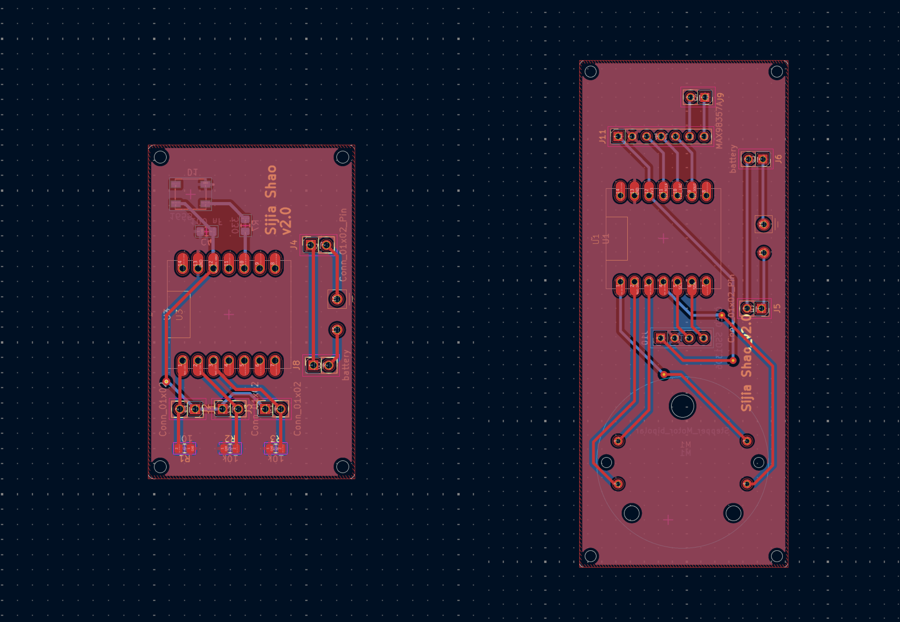

# Sound Bloom

#### Author: Sijia Shao

A tangible approach to music interaction using pressure as the primary input and a stepper-motor-driven gauge as a physical, glanceable output.

## Concept

This project explores the relationship between touch, sound, and motion. Rather than focusing on melody or note-level control, the system emphasizes **layered sound**, **intensity**, and **physical feedback**. Users control multiple instrumental layers through simple pressure input, while a mechanical gauge visualizes overall musical intensity in real time.

The system consists of two wireless units communicating over BLE (Bluetooth Low Energy):

- **Sender** — an interactive pressure surface with three Force Sensitive Resistors (FSRs)
- **Receiver** — a sound engine with mixed audio output, a stepper-motor gauge, and an OLED display

Each FSR is mapped to the volume of a single pre-recorded instrumental loop. Pressing harder increases that instrument's presence in the mix. The combined intensity drives a physical needle gauge, creating an intuitive, tactile music-making experience.

## How It Works

### Sensors and Input

The Sender unit reads three FSR pressure sensors and transmits continuous pressure values (0–100%) to the Receiver over BLE at 20Hz.

| FSR | Pin | Instrument |
|-----|-----|------------|
| FSR 1 | D0 (GPIO2) | Guitar |
| FSR 2 | D1 (GPIO3) | Piano |
| FSR 3 | D2 (GPIO4) | Pad |

Each sensor uses a voltage divider circuit with a 10kΩ pull-down resistor. The analog readings are smoothed with an 8-sample moving average on the Sender side, and further smoothed with an exponential moving average filter (α = 0.08) on the Receiver side, resulting in fluid, natural-feeling volume transitions.

### Sound Engine

The Receiver plays three WAV loops simultaneously, mixed in real time using direct PCM processing — no MP3 decoding overhead. Each track's amplitude is scaled by its corresponding FSR pressure value before the three signals are summed.

Audio specifications:
- Format: WAV, 8-bit unsigned, mono
- Sample rate: 8000 Hz
- Output: I2S external DAC (MAX98357A)
- Mixing: 256-sample buffer, software mix with clipping protection

When no FSR is pressed, all tracks are silent. As pressure increases, instruments fade in proportionally.

### Physical Output

**Stepper Motor Gauge** — A 28BYJ-48 stepper motor drives a needle that swings left-to-right based on the aggregate volume across all three instruments. The motor operates non-blocking so it never interrupts audio playback.

**OLED Display (128×64, SSD1306)** — Shows a real-time interface with:
- Boot animation with bouncing music note icons
- Three labeled volume bars with percentage readouts (Guitar, Piano, Flute)
- Aggregate total volume percentage
- BLE connection status indicator

## Hardware

### Components

- 2× Seeed Studio XIAO ESP32-C3
- 3× Force Sensitive Resistors (FSRs)
- 3× 10kΩ resistors
- 1× I2S DAC module (MAX98357A or PCM5102A)
- 1× Speaker
- 1× 28BYJ-48 stepper motor + ULN2003 driver board
- 1× SSD1306 OLED display (128×64, I2C)


## Software Architecture


### Schematics


### PCB Design



### Communication Protocol

BLE Notify characteristic carrying 3 bytes: `[guitar_pct, piano_pct, flute_pct]`, each 0–100.

### Key Technical Decisions

- **WAV instead of MP3**: ESP32-C3 is single-core. Decoding three MP3 streams simultaneously caused severe stuttering. Raw PCM from WAV files requires zero CPU for decoding.
- **8-bit 8kHz audio**: Keeps file sizes under 100KB each, fitting comfortably in SPIFFS (~283KB total for three 12-second loops).
- **Exponential smoothing**: Applied on the Receiver to create gradual volume transitions rather than abrupt jumps from raw sensor noise.
- **Non-blocking motor**: Stepper runs one step per loop iteration, never blocking the audio pipeline.


### Prerequisites

- [PlatformIO](https://platformio.org/) (VS Code extension or CLI)
- USB-C cables for both XIAO ESP32-C3 boards


### Usage

1. Power on the Sender (USB or battery)
2. Power on the Receiver — OLED shows boot animation, then scans for BLE
3. Connection established automatically (OLED shows "BT" indicator)
4. Press FSRs to control instrument volumes
5. Watch the gauge needle respond to overall intensity

## Project Structure

```
├── sender/
│   ├── src/
│   │   └── main.cpp          # FSR reading + BLE broadcast
│   └── platformio.ini
│
├── receiver/
│   ├── src/
│   │   └── main.cpp          # Audio mixer + motor + OLED + BLE client
│   ├── data/
│   │   ├── guitar.wav         # 8kHz 8-bit mono
│   │   ├── piano.wav
│   │   └── flute.wav
│   ├── partitions.csv         # Custom flash partition table
│   └── platformio.ini
│
└── README.md
```

## Libraries

- [NimBLE-Arduino](https://github.com/h2zero/NimBLE-Arduino) — Lightweight BLE stack for ESP32
- [Adafruit SSD1306](https://github.com/adafruit/Adafruit_SSD1306) — OLED display driver
- [Adafruit GFX](https://github.com/adafruit/Adafruit-GFX-Library) — Graphics primitives
- ESP-IDF I2S driver — Direct hardware audio output

## Future Directions

- Expand to 5 instruments (violin, drums, brass) with additional FSRs
- Add generative music elements alongside the loop layers
- Upgrade to a color OLED or TFT for richer visual feedback
- Implement gesture recognition for performance modes
